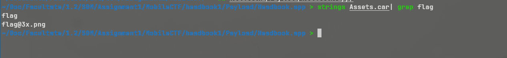

# Flag 04

## Writeup

This challenge involves examining the Assets.car file. In it we find a stored image. Below is an image of the image that exists in Assets.car.



I use a tool from GitHub called acextract (https://github.com/bartoszj/acextract) to get the image.

```sh
acextract -i Assets.car -o assets_extracted
```

Inside of that image, we can see the flag in plaintext.

```sh
feh assets_extracted/flag109x18@3x.png
```

The flag is: flag-2F110A91-4BAC-4A18-A680-A6C2987CC2C4

## Recording

[Video Recording Flag 04](https://youtu.be/fwclsrXhUL8)

