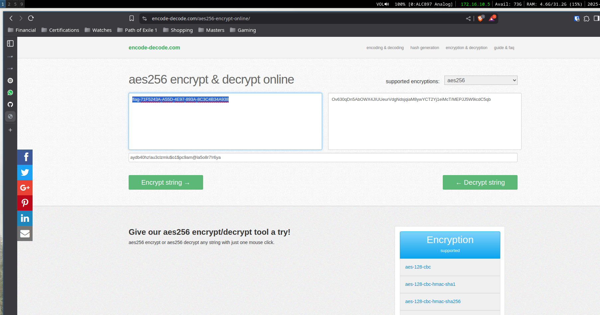

# Flag 06

## Writeup 

For this challenge I begin by looking for anything inside of the .ipa file. I don't see anything obvious. I open MobSF to scan better. I find a key/value pair called **enc_key**, which would obviously mean that i should find the flag encrypted somewhere.

I open ghidra and look for flags, as I did in the previous challenges. I find the flag, with a message pointing out that it is encrypted. I now have both the flag and the encryption key. 

Below is a picture of a site used to decrypt the flag.

Flag is:  flag-71F5243A-A55D-4E97-893A-8C3C4B34A938

## Recording

[Video Recording Flag 06](https://youtu.be/bktbJRnQP_s)